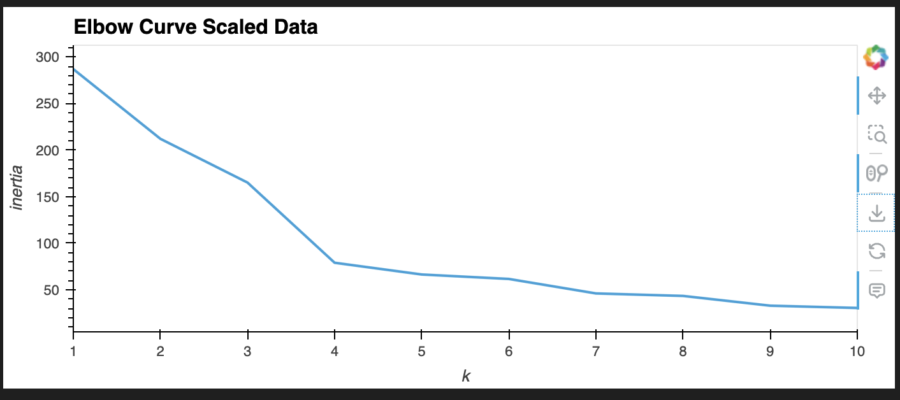
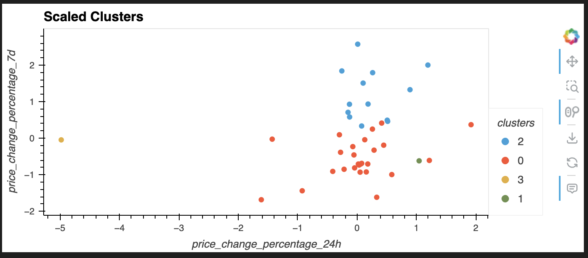
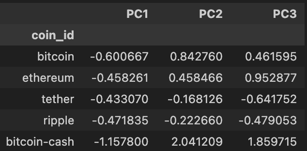
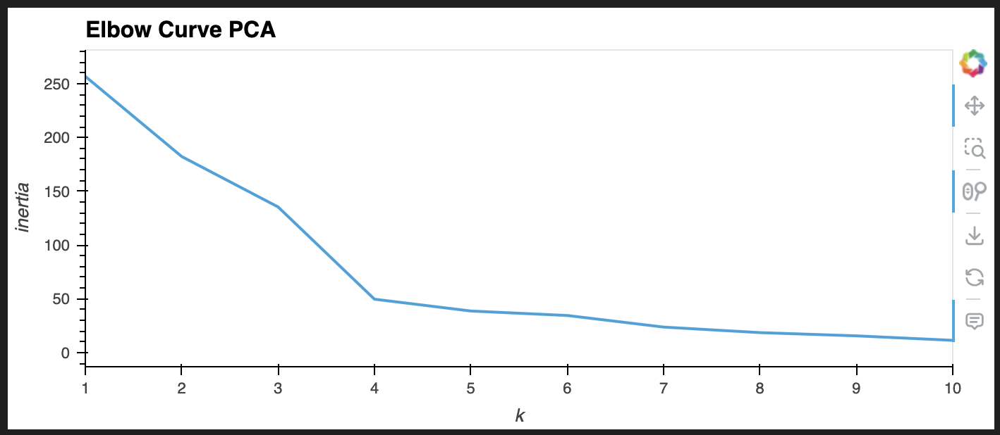
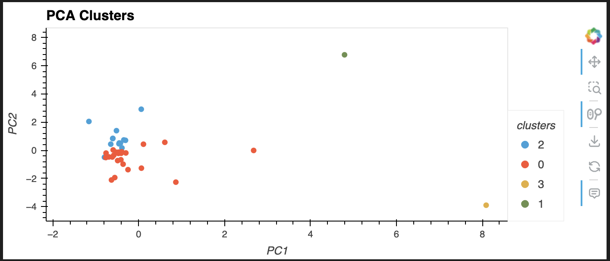

# Unsupervised Learning: Clustering Cryptocurrencies
## Overview
This project leverages Python and unsupervised learning techniques to analyze and cluster cryptocurrencies. The goal is to determine if cryptocurrencies are influenced by 24-hour or 7-day price changes. Using k-means clustering and Principal Component Analysis (PCA), the project explores patterns and optimizes clustering for better insights.

## Files and Folders 
* crypto_market_data.csv - Contains the cryptocurrency market data.
* Crypto_Clustering.ipynb - upyter Notebook with the analysis and script.

## Data Preparation
1) Loading the Data:
The data was imported from the CSV file into a Pandas DataFrame.
2) Summary Statistics:
Generated descriptive statistics to understand the dataset.
3) Normalization:
Data was normalized using the StandardScaler() module from scikit-learn.
4) Indexing:
The coin_id column was set as the index for better data handling.

## Find the Best Value for k (Scaled DataFrame)
The elbow method was used to determine the optimal number of clusters (k):

1) Created a list of potential k values from 1 to 11.
2) Computed inertia values for each k using a for loop.
3) Plotted the elbow curve as a line chart to visualize and identify the optimal k.
4) Optimal k: Found to be 4.

## Clustering Cryptocurrencies (Scaled DataFrame)
Steps for clustering using the scaled DataFrame:

1) Initialized a k-means model with k=4.
2) Fit the k-means model to the scaled DataFrame.
3) Predicted clusters and grouped cryptocurrencies.
4) Created a new column in the scaled DataFrame to store cluster labels.
5) Visualized clusters using hvPlot:
    * X-axis: price_change_percentage_24h
    * Y-axis: price_change_percentage_7d
    * Color: Cluster labels
    * Hover: coin_id for cryptocurrency identification
    
## Optimizing Clusters with PCA
To simplify clustering, Principal Component Analysis (PCA) was used to reduce dimensionality:

1) Reduced features to 3 principal components.
2) Achieved approximately 90% explained variance.
3) Created a new DataFrame with PCA-transformed data and retained coin_id as the index.

## Finding the Best Value for k (PCA DataFrame)

The elbow method was applied to the PCA-transformed DataFrame:

1) Generated inertia values for k values from 1 to 11.
2) Plotted an elbow curve to identify the optimal k.
3) Optimal k: Found to be 4.

## Clustering Cryptocurrencies (PCA DataFrame) 
Steps for clustering using the PCA-transformed data:

1) Initialized a k-means model with k=4.
2) Fit the k-means model to the PCA-transformed DataFrame.
3) Predicted clusters and grouped cryptocurrencies.
4) Created a new column in the PCA DataFrame to store cluster labels.
5) Visualized clusters using hvPlot:
    * X-axis: PC1
    * Y-axis: PC2
    * Color: Cluster labels
    * Hover: coin_id for cryptocurrency identification
    

## Key Insights

* PCA Simplification: Reduced dimensionality while retaining 90% of variance, enabling efficient and interpretable clustering.
* Cluster Visualization: Highlighted distinct groups of cryptocurrencies based on their 24-hour and 7-day price change patterns.    

## Modules Used

* Python: Core programming language.
* scikit-learn: For k-means clustering and PCA.
* hvPlot: For interactive visualizations.